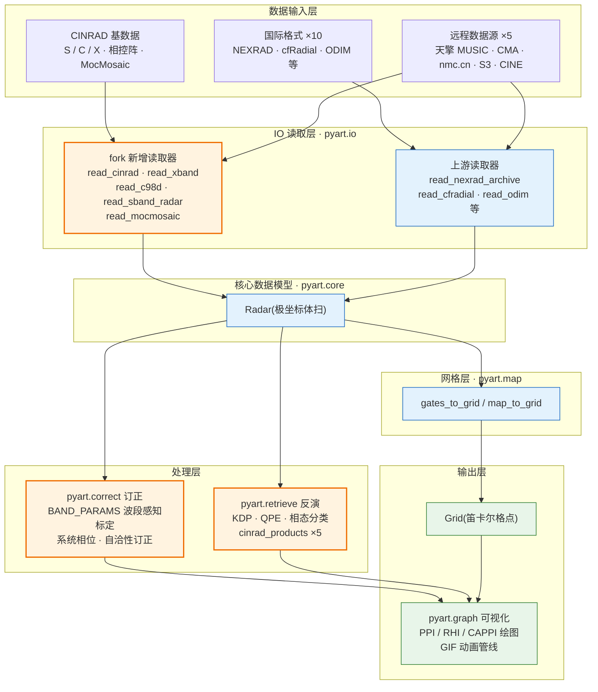
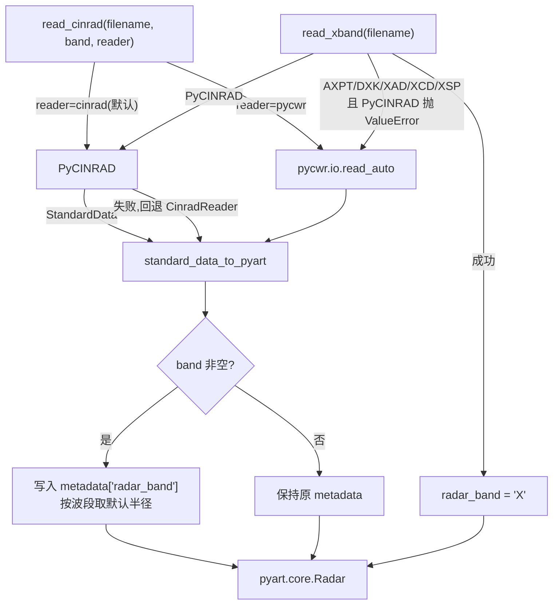
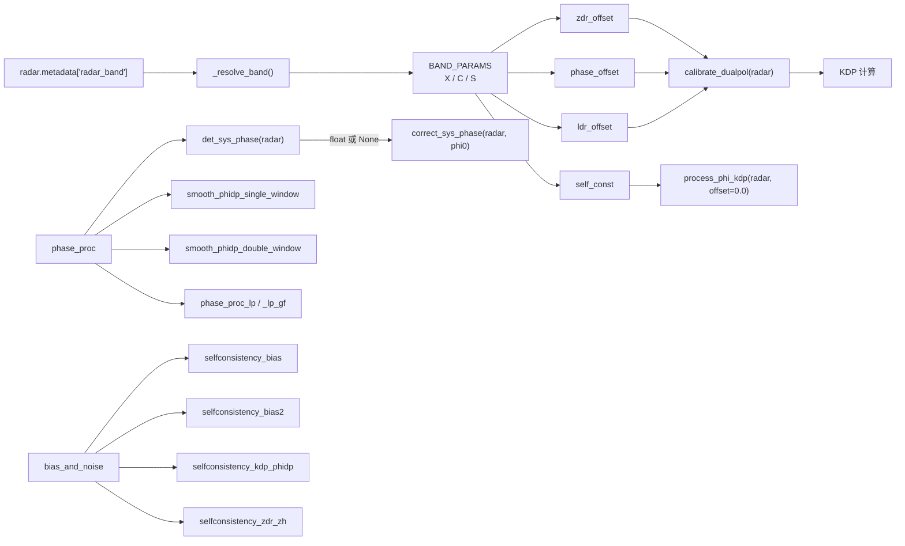
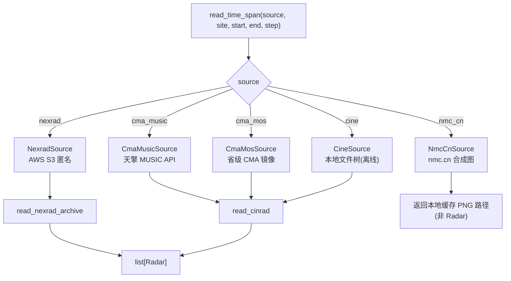
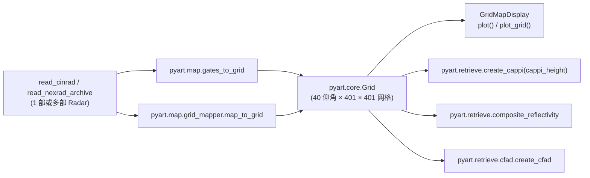

# Py-ART · 国内 X/S/C 双偏振增强版


在 ARM-DOE/pyart 之上,面向中国天气雷达业务与科研的增强 fork.
补齐四项核心能力:CINRAD 基数据读取 · X/S/C 三波段双偏振处理 · GIF 动画管线 · 国内远程数据源.

**核心亮点**

- **CINRAD 基数据读取** — 5 个专用读取器(`read_cinrad` / `read_xband` / `read_c98d` / `read_sband_radar` / `read_mocmosaic`)覆盖 S/C/X 三波段、X 波段相控阵与 MocMosaic/ACHN 复合产品,双后端冗余(PyCINRAD 优先,pycwr 回退)
  - **逐型号支持**:**SA** / **SB** / **CB** / **CC** / **CCJ** / **SC** / **CD** 七种在役型号 + 前代 **WSR-98D**,共 **8 种** CINRAD 基数据格式;另有 X 波段相控阵(AXPT / DXK / XAD / XCD / XSP)与 C 波段 C98D 归档.每种型号的波段、默认半径、入口函数与验证状态见 [§2.2 逐型号覆盖矩阵](#22-cinrad-型号逐型号覆盖矩阵)
- **波段感知双偏振处理** — `BAND_PARAMS` 参数表按 X/C/S 统一驱动标定与 Φ-KDP 处理,集成 MeteoSwiss 系统相位、LP 相位处理与 4 族自洽性订正
- **GIF 动画管线** — 6 个动画函数(PPI / RHI / 地图 / 时间跨度 / 批量 / 三波段对比)× 4 套渲染模板
- **国内远程数据源** — 天擎 MUSIC、CMA 省级镜像、nmc.cn 合成图、NEXRAD S3、本地 CINE 文件树,统一收敛到 `read_time_span` 单一接口

**关键指标**

| 维度    | 数值                                       | 维度    | 数值                          |
| ----- | ---------------------------------------- | ----- | --------------------------- |
| 文件格式  | 10 种国际格式 + 8 条国内读取通道(见 [§2.3](#23-数据格式支持)) | 远程数据源 | 5 个                         |
| 波段参数表 | X / C / S 三套                             | 动画函数  | 6 个 + 4 套模板                 |
| CINRAD 型号 | 8 种(7 在役 + 1 前代)                        | 代码规模  | 153 个 Python 源文件            |
| 测试用例  | 1042 收集(**基线数字,复现前提见 [§9](#9-测试与质量)**) | 回归基线  | 971 通过 / 71 跳过 / 0 失败        |

**快速导航**(按读者画像分组):

- **业务雷达用户** — [§2.2 型号矩阵](#22-cinrad-型号逐型号覆盖矩阵) → [§4.1 读取器](#41-读取雷达基数据) → [§4.4 远程数据源](#44-拉取远程数据) → [§8 故障排查](#8-故障排查)
- **双偏振研究者** — [§2.4 双偏振能力](#24-双偏振处理能力) → [§4.2 双偏振处理](#42-双偏振处理) → [§5.2 流水线](#52-双偏振流水线) → [§7 术语表](#7-术语表)
- **动画 / 可视化用户** — [§2.5 模块差异](#25-模块级差异) → [§4.3 GIF 动画](#43-生成-gif-动画) → [§4.5 网格产品](#45-网格产品与格点绘图)
- **贡献者 / 开发者** — [§3 安装](#3-安装) → [§5 架构与设计](#5-架构与设计) → [§6 配置定制](#6-配置与运行时定制) → [§9 测试与质量](#9-测试与质量) → [§11 贡献](#11-贡献--引用--许可--致谢)

## Important Links

| 类别               | 链接                                                    |
| ---------------- | ----------------------------------------------------- |
| 上游仓库             | <https://github.com/ARM-DOE/pyart>                    |
| 上游文档             | <https://arm-doe.github.io/pyart/>                    |
| 上游示例库            | <https://arm-doe.github.io/pyart/examples>            |
| 上游 Issue 追踪      | <https://github.com/ARM-DOE/pyart/issues>             |
| 邮件列表 / Discourse | <https://openradar.discourse.group/tag/py-art>        |
| PyPI(上游)         | <https://pypi.org/project/arm-pyart/>                 |
| conda-forge(上游)  | <https://anaconda.org/conda-forge/arm_pyart>          |
| **本 fork 专属示例**  | `examples/plotting/plot_dualpol_animation.py`         |
| **本 fork 自检脚本**  | `scripts/verify_remote_sources.py`                    |
| **代码示例补编**       | `README_CODE_EXAMPLES.md`（§4.1–§4.5 与 §8 的大段示例已移至此文件） |

> [!IMPORTANT]
>
> 本 fork **未发布**到 PyPI / conda,与上游共用包名 `arm_pyart`;
>
> `pip install arm_pyart` 仅安装上游版本,不含本 fork 任何增强.
>
> 获取本 fork 请按 [§3 安装](#3-安装)从源码安装.

> [!NOTE]
>
> 本文档中所有 API 名称、签名、默认值与环境变量均于 2026-08-31 在
>
> Python 3.12 / Windows / pyart 2.2.5.post13+dirty 环境实测核验.


## 目录

- [1 项目定位](#1-项目定位)
  - [1.1 总览架构](#1-项目定位)
  - [1.2 问题陈述](#1-项目定位)
  - [1.3 与上游的关键差异](#13-与上游的关键差异)
  - [1.4 相关生态与扩展项目](#14-相关生态与扩展项目)
- [2 核心能力](#2-核心能力)
  - [2.1 能力矩阵](#21-能力矩阵)
  - [2.2 CINRAD 型号逐型号覆盖矩阵](#22-cinrad-型号逐型号覆盖矩阵)
  - [2.3 数据格式支持](#23-数据格式支持)
  - [2.4 双偏振处理能力](#24-双偏振处理能力)
  - [2.5 模块级差异](#25-模块级差异)
- [3 安装](#3-安装)
  - [3.1 源码安装](#31-源码安装)
  - [3.2 依赖分层](#32-依赖分层)
  - [3.3 运行环境矩阵](#33-运行环境矩阵)
- [4 快速开始](#4-快速开始)
  - [4.1 读取雷达基数据](#41-读取雷达基数据)
  - [4.2 双偏振处理](#42-双偏振处理)
  - [4.3 生成 GIF 动画](#43-生成-gif-动画)
  - [4.4 拉取远程数据](#44-拉取远程数据)
  - [4.5 网格产品与格点绘图](#45-网格产品与格点绘图)
- [5 架构与设计](#5-架构与设计)
  - [5.1 IO 读取层](#51-io-读取层)
  - [5.2 双偏振流水线](#52-双偏振流水线)
  - [5.3 远程数据源层](#53-远程数据源层)
  - [5.4 网格映射层](#54-网格映射层)
  - [5.5 安全设计](#55-安全设计)
- [6 配置与运行时定制](#6-配置与运行时定制)
- [7 术语表](#7-术语表)
- [8 故障排查](#8-故障排查)
- [9 测试与质量](#9-测试与质量)
- [10 文档索引](#10-文档索引)
- [11 贡献 · 引用 · 许可 · 致谢](#11-贡献--引用--许可--致谢)

**阅读指引**

| 读者角色      | 建议路径                                                                       |
| --------- | -------------------------------------------------------------------------- |
| 业务 / 工程用户 | [§3 安装](#3-安装) → [§4 快速开始](#4-快速开始) → [§8 故障排查](#8-故障排查)                   |
| 科研 / 算法用户 | [§2 核心能力](#2-核心能力) → [§5 架构与设计](#5-架构与设计) → [§7 术语表](#7-术语表)               |
| 贡献者 / 开发者 | [§9 测试与质量](#9-测试与质量) → [§10 文档索引](#10-文档索引) → [§11 贡献](#11-贡献--引用--许可--致谢) |

---

## 1 项目定位


### 1.1 总览架构

下图为本 fork 的分层能力全景:数据自上而下依次流经输入层、IO 读取层、核心数据模型与处理层,
最终经网格层或直接导出为 `Grid` 对象与图像产品.



**配色语义**:橙色节点为本 fork 新增或增强的能力,蓝色节点为上游既有能力(行为未改动),绿色节点为数据产出.

> [!NOTE]
>
> 例外路径:`read_mocmosaic` 读取的 MocMosaic / ACHN 为格点产品,
>
> 直接返回 `Grid` 而非 `Radar`,不经过核心数据模型(详见 [§5.1](#51-io-读取层)).

各层内部设计详见 [§5 架构与设计](#5-架构与设计);与上游逐模块的差异清单见 [§2.5](#25-模块级差异).

### 1.2 问题陈述

`ARM-DOE/pyart` 是 Atmospheric Radiation Measurement(ARM)用户设施维护的科学级雷达工具包,
其设计目标是 ARM 在 **X / Ka / W** 波段的多平台雷达科研场景.
中国气象业务雷达网(CINRAD,见 [§7 术语表](#7-术语表))以 **S 波段为主、C 波段次之、
X 波段相控阵为新兴力量**,波段特性与数据格式均与 ARM 体系不同,带来三个层面的缺口:

| 层次       | 上游现状                | 造成的后果               |
| -------- | ------------------- | ------------------- |
| **数据读取** | 不支持 CINRAD 基数据格式    | 国内基数据无法进入 Py-ART 生态 |
| **参数化**  | 标定参数面向 ARM 科研波段     | S / C 波段套用会引入系统性偏差  |
| **数据源**  | 远程获取以 AWS NEXRAD 为例 | 国内缺乏可用的拉取通道         |

本 fork 针对上述缺口,在**保持与上游 API 完全兼容**的前提下做增强,
不修改任何上游既有函数的行为.波段参数通过 `BAND_PARAMS`(见 [§5.2](#52-双偏振流水线))
收敛到统一字典,数据源通过注册机制(`pyart.io.remote`)扩展为 5 个.

### 1.3 与上游的关键差异

| 维度    | 上游 ARM-DOE/pyart                                         | 本 fork                                         |
| ----- | -------------------------------------------------------- | ---------------------------------------------- |
| 适用场景  | ARM 在 X/Ka/W 波段的多平台雷达科研                                  | 上游全部 + 中国 X/S/C 三波段业务与科研                       |
| 核心数据源 | ARM NetCDF、cfRadial、NEXRAD、ODIM_H5、RSL、UF、MDV、SIGMET、CHL | 上游全部 + CINRAD 基数据、MocMosaic/ACHN 复合产品          |
| 波段覆盖  | X / Ka / W                                               | **X / S / C** 三波段 + 相控阵                        |
| 双偏振处理 | 通用 `correct_*` / `retrieve_*` 算法集                        | `BAND_PARAMS` 统一驱动 + MeteoSwiss 系统相位与自洽性       |
| 可视化   | 单帧 PPI / RHI / 网格 / Airborne 绘制                          | 完整 GIF 流水线(6 个函数 + 4 套模板)                      |
| 远程获取  | 示例性 AWS 匿名 S3 脚本                                         | 通用抽象层 + 5 个数据源(含天擎 MUSIC)                      |
| 网格映射  | 上游 `map.gates_to_grid` / `grid_mapper`                   | 与上游完全同步,保持 C 扩展兼容                              |
| 工程安全  | 基础科研项目标准                                                 | SSRF 防护、路径穿越防护、原子写、模板占位符安全(见 [§5.5](#55-安全设计)) |


### 1.4 相关生态与扩展项目

下列项目与 Py-ART 协同使用,本 fork 全部兼容:

| 项目                                                                         | 性质      | 用途                            |
| -------------------------------------------------------------------------- | ------- | ----------------------------- |
| [ARM-DOE/pyart](https://github.com/ARM-DOE/pyart)                          | 上游      | 科学级雷达工具包基线                    |
| [MeteoSwiss/pyart](https://github.com/MeteoSwiss/pyart)                    | 上游 fork | 系统相位 / 平滑 / 质控算法源(本 fork 已借鉴) |
| [ARTView](https://github.com/nguy/artview)                                 | 配套工具    | 交互式雷达浏览器                      |
| [pyrad](https://github.com/MeteoSwiss/pyrad)                               | 配套工具    | 实时数据处理框架                      |
| [PyTDA](https://github.com/openradar/PyTDA)                                | 算法库     | 湍流检测算法                        |
| [SingleDop](https://github.com/openradar/SingleDop)                        | 算法库     | 单多普勒反演工具集                     |
| [DualPol](https://github.com/openradar/DualPol)                            | 算法库     | 双偏振算法 Python 接口               |
| [PyBlock](https://github.com/openradar/PyBlock)                            | 算法库     | 极化雷达波束遮挡计算                    |
| [wradlib](https://github.com/wradlib/wradlib)                              | 互补库     | 另一套天气雷达处理库(德国气象局)             |
| [BALTRAD](https://github.com/baltrad/baltrad)                              | 互补库     | 社区雷达组网                        |
| [MMM-Py](https://github.com/openradar/MMM-Py)                              | 配套工具    | Marshall MRMS Mosaic 工具       |
| [CSU\_RadarTools](https://github.com/CSU-Radarmet/CSU_RadarTools)          | 配套工具    | 科罗拉多州立大学雷达工具                  |
| [RadX](https://github.com/NCAR/Radx)                                       | C++ 库   | NCAR 径向雷达数据 C++ 工具            |
| [PyDDA](https://github.com/openradar/PyDDA)                                | 配套工具    | 多普勒风场反演                       |
| [PyCINRAD](https://github.com/CyanideCN/PyCINRAD)                          | 后端      | 国内雷达读取主后端(PyPI: `cinrad`)     |
| [pycwr](https://github.com/YvZheng/pycwr)                                  | 后端      | 国内雷达读取回退后端                    |
| [zssherman/pyart\_animation](https://github.com/zssherman/pyart_animation) | 灵感来源    | NEXRAD 动画管线                   |
| [nmcdev/metradar](https://github.com/nmcdev/metradar)                      | 参考      | 中国天气雷达处理参考实现                  |

---

## 2 核心能力


### 2.1 能力矩阵

| 能力 | 状态 | 入口 |
|------|:----:|------|
| CINRAD S/C/X 通用读取 | ✅ | `read_cinrad(filename, band=...)` |
| X 波段相控阵 (AXPT/DXK/XAD/XCD/XSP) | ✅ | `read_xband(filename)` |
| C 波段 C98D 二进制归档 | ✅ | `read_c98d(filename)` |
| S 波段 CINRAD-SA | ✅ | `read_sband_radar(filename)` |
| MocMosaic / ACHN 复合产品 | ✅ | `read_mocmosaic(filename, product=...)` |
| 实验性 X 波段 (724xsp / scrxd01) | ⚠️ | `read_xband_724xsp` / `read_xband_scrxd01` |
| cfRadial1 / 2 | ✅ | `read_cfradial(filename)` |
| NEXRAD Level II 归档 | ✅ | `read_nexrad_archive(filename)` |
| NEXRAD Level III | ✅ | `read_nexrad_level3(filename)` |
| NEXRAD CDM | ✅ | `read_nexrad_cdm(filename)` |
| ODIM_H5 | ✅ | `read_odim(filename)` |
| SIGMET / IRIS | ✅ | `read_sigmet(filename)` |
| UF(通用格式) | ✅ | `read_uf(filename)` |
| RSL(TRMM) | ✅ | `read_rsl(filename)` |
| MDV | ✅ | `read_mdv(filename)` / `read_grid_mdv` |
| CHL | ✅ | `read_chl(filename)` |
| ARM 探空 | ✅ | `read_arm_sonde(filename)` |
| GIF 动画 | ✅ | `pyart.graph.animation`(6 函数 + 4 模板) |
| 远程数据源 | ✅ | `read_time_span(source, site, start, end, step)` |
| 双偏振标定 | ✅ | `cband_sband.calibrate_dualpol` |
| Φ-KDP 处理 | ✅ | `cband_sband.process_phi_kdp` |
| KDP 算法集 | ✅ | `retrieve.kdp_proc`(`kdp_maesaka` / `kdp_schneebeli` / `kdp_vulpiani`) |
| MeteoSwiss 系统相位 | ✅ | `phase_proc.{det,correct}_sys_phase` |
| LP 相位处理 | ✅ | `phase_proc.phase_proc_lp` / `_gf` |
| 自洽性订正 | ✅ | `bias_and_noise.selfconsistency_*`(4 族) |
| 地基杂波抑制 | ✅ | `pyart.correct.clutter` |
| CINRAD 业务产品 | ✅ | `retrieve.cinrad_products.*`(5 个产品) |
| QPE 7 族 | ✅ | `retrieve.qpe.est_rain_rate_*` |
| QVP / 垂直廓线 | ✅ | `retrieve.qvp` |
| VAD 风廓线 | ✅ | `retrieve.vad.{vad_browning, vad_michelson}` |
| SRV 风暴相对速度 | ✅ | `retrieve.srv.storm_relative_velocity` |
| 复合反射率 | ✅ | `retrieve.comp_z.composite_reflectivity` |
| CAPPI | ✅ | `retrieve.cappi.create_cappi` |
| CFAD | ✅ | `retrieve.cfad.create_cfad` |
| 对流/层状分类 | ✅ | `retrieve.echo_class.{steiner_conv_strat, conv_strat_yuter, conv_strat_raut, hydroclass_semisupervised, wavelet_reclass}` |
| 简单矩计算 | ✅ | `retrieve.simple_moment_calculations`(`compute_snr` / `compute_cdr` / `angular_texture_2d` / `velocity_texture` 等) |
| 频谱矩 | ✅ | `retrieve.spectra_calculations` |
| 平流与位移 | ✅ | `retrieve.advection.{grid_shift, shift, grid_displacement_pc}` |
| xradar 互操作 | ⚠️ 单向 | `xradar.to_pyart_radar`(反向未实现) |

> 状态图例:✅ 已实现 / ⚠️ 部分实现或需自行验证 / ❌ 不支持

> 测试规模与质量门槛见 [§9 测试与质量](#9-测试与质量)。


### 2.2 CINRAD 型号逐型号覆盖矩阵

**背景**:CINRAD 业务网包含多种雷达型号(SA/SB/CB/CC/CCJ/SC/CD 与前代 WSR-98D),
字节流细节各异.上表的"通用读取"一行未覆盖逐型号支持状态,本节以
**8 个具体型号 × 7 维度**的紧凑矩阵做透明度披露.数据全部实测自
`pyart.io.cinrad_bridge` 与 `cinrad 1.9 infer_type`,由
`pyart/io/tests/test_cinrad_routing.py`(22 个测试函数,含 4 组参数化)锁死.

| 型号 | 业务命名样例 | 波段 | 默认半径 | 入口 | cinrad 1.9 识别 | 端到端验证 |
|------|-------------|:----:|:--------:|------|:--------------:|:----------:|
| **CINRAD/SA** | `Z_RADR_I_Z9200_..._O_DOR_SA_CAP.bin` | S | 460 km | `read_cinrad` / `read_sband_radar` | ✅ magic | routing ✅,e2e 待 `CINRAD_TEST_FILE` |
| **CINRAD/SB** | `Z_RADR_I_Z9200_..._O_DOR_SB_CAP.bin` | S | 460 km | `read_cinrad` | ✅ | 同上 |
| **CINRAD/CB** | `Z_RADR_I_Z9200_..._O_DOR_CB_CAP.bin` | C | 230 km | `read_cinrad` | ✅ | 同上 |
| **CINRAD/CC** | `Z_RADR_I_Z9200_..._O_DOR_CC_CAP.bin` | C | 230 km | `read_cinrad` | ✅ (头部 magic `CINRAD/CC`) | 同上 |
| **CINRAD/CCJ** | `Z_RADR_I_Z9200_..._O_DOR_CCJ_CAP.bin` | C | 230 km | `read_cinrad` | ✅ (`spart[7]='CCJ'`) | 同上 |
| **CINRAD/SC** | `Z_RADR_I_Z9200_..._O_DOR_SC_CAP.bin` | S | 460 km | `read_cinrad` | ✅ (头部 magic `CINRAD/SC`) | 同上 |
| **CINRAD/CD** | `Z_RADR_I_Z9200_..._O_DOR_CD_CAP.bin` | C | 230 km | `read_cinrad` | ✅ (头部 magic `CINRAD/CD`) | 同上 |
| **WSR-98D** | `Z_RADR_C_DOPPLER_WSR98D_20190421.bin` | S | 460 km | `read_cinrad`(自动检测) | ❌ (桥接层强制 `radar_type='SA'`) | routing ✅,e2e 仅 SA 兼容路径 |

**列说明**:
- **业务命名样例**:`Z_RADR_I_<站号>_<时间>_O_DOR_<型号>_CAP.bin` 模板
  (WSR-98D 例外,采用 1998 年历史命名 `Z_RADR_C_DOPPLER_WSR98D_...`)
- **默认半径**:`read_cinrad(..., band=...)` 传 `band` 且未显式覆盖 `radius` 时的默认 km
- **cinrad 1.9 识别**:`cinrad.io.level2.infer_type` 对该业务命名的识别能力;
  `magic` 表示通过文件头 `CINRAD/<TYPE>` 9 字节魔数识别,`spart[7]` 表示
  通过下划线分隔字段[7] 识别
- **端到端验证**:`routing ✅` 表示分派到正确 reader 函数(由 `test_cinrad_routing.py` 覆盖);
  `e2e 待 CINRAD_TEST_FILE` 表示需用户提供真实 CINRAD 基数据文件以验证
  字节流级解析

**型号之间的差异**:
- **CINRAD/SA 还有专属入口** `read_sband_radar`(走 S 波段优化的字节路径),
  `read_cinrad(..., band='S')` 是通用入口——两条路径功能等价但走法不同
- **CINRAD/CCJ** 是 CINRAD/CC 的升级版(双偏振增强),`infer_type` 单独
  识别为 `'CCJ'`,pyart 路由层用 `'CC' in name` 子串匹配,会同时命中
  CC 与 CCJ——已由 `test_cinrad_routing.py` 覆盖
- **CINRAD/SC** 与 **CINRAD/CD** 是双偏振 S/C 多普勒雷达,头部带
  `CINRAD/SC` / `CINRAD/CD` 9 字节魔数(SS/CINRAD/CD 是从偏移 100 / 116
  读取),其余 5 种走文件名识别


### 2.3 数据格式支持

<details>
<summary>点击展开 10 种国际格式 + 8 条国内读取通道的支持矩阵</summary>

| 格式 / 通道 | 上游 | 本 fork | 入口 |
|------|:----:|:-------:|------|
| ARM NetCDF | ✓ | ✓ | `read_cfradial` / `read_arm_sonde` |
| cfRadial1 / 2 | ✓ | ✓ | `read_cfradial` |
| NEXRAD Level II | ✓ | ✓ | `read_nexrad_archive` / `read_nexrad_cdm` |
| NEXRAD Level III | ✓ | ✓ | `read_nexrad_level3` |
| ODIM_H5 | ✓ | ✓ | `read_odim` |
| SIGMET / IRIS | ✓ | ✓ | `read_sigmet` |
| UF(通用格式) | ✓ | ✓ | `read_uf` |
| RSL(TRMM) | ✓ | ✓ | `read_rsl` |
| MDV | ✓ | ✓ | `read_mdv` / `read_grid_mdv` |
| CHL | ✓ | ✓ | `read_chl` |
| **CINRAD 标准基数据 (S/C/X)** | — | ✓ | `read_cinrad(filename, band=...)` |
| **CINRAD 相控阵 (AXPT/DXK/XAD/XCD/XSP)** | — | ✓ | `read_xband(filename)` |
| **CINRAD 复合产品 (MocMosaic/ACHN)** | — | ✓ | `read_mocmosaic(filename, product=...)` |
| **C 波段 C98D 二进制归档** | — | ✓ | `read_c98d(filename)` |
| **天擎 MUSIC (CINRAD Level-2)** | — | ✓ | `read_time_span('cma_music', ...)` |
| **CMA 省级镜像** | — | ✓ | `read_time_span('cma_mos', ...)`(需注入 `station_config`) |
| **nmc.cn 合成图** | — | ✓ | `read_time_span('nmc_cn', ...)`(仅栅格,非体扫) |
| **本地 CINE 文件树** | — | ✓ | `read_time_span('cine', ...)`(完全离线) |

> `✓` = 支持,`—` = 不支持.MocMosaic/ACHN 返回 `Grid` 而非 `Radar`,
> 需用 `GridMapDisplay` 绘图(见 [§8 故障排查](#8-故障排查)).

</details>


### 2.4 双偏振处理能力

<details>
<summary>点击展开 12 项双偏振处理能力对照</summary>

| 能力 | 上游 | 本 fork |
|------|------|---------|
| 基础标定 | 通用 `correct_*` | `BAND_PARAMS` 按 X/C/S 统一驱动 |
| Φ-KDP | `process_phi_kdp`(通用) | 同名,`self_const` 默认值按 `radar_band` 注入 |
| KDP 算法 | — | `kdp_maesaka` / `kdp_schneebeli` / `kdp_vulpiani` + `boundary_conditions_maesaka` |
| 系统相位检测 | `det_sys_phase` | + `det_sys_phase_ray`(径向版)<br>+ `det_sys_phase_gf`(GateFilter 版) |
| 系统相位订正 | `correct_sys_phase` | 保留掩码,不丢数据 |
| ΦDP 平滑 | 单窗 | + `smooth_phidp_double_window` |
| LP 相位处理 | 部分 | 完整流水线:`construct_A_matrix` + cvxopt / pyglpk / cylp 求解器 |
| 自洽性订正 | 部分 | 4 族:`bias` / `bias2` / `kdp_phidp` / `zdr_zh` |
| ZDR 估计 | — | `est_zdr_precip` / `est_zdr_snow` |
| RHOHV 估计 | — | `est_rhohv_rain` |
| QPE | Z / Z-KDP | 7 族:`est_rain_rate_{z, zpoly, kdp, zkdp, a, za, hydro}` |
| 相态分类 | — | `cinrad_products.hydro_class`(PyCINRAD hybrid) |
| 复合产品 | — | `cinrad_products.{composite_reflectivity, echo_tops, vert_integrated_liquid, cappi}` |

</details>


### 2.5 模块级差异

<details>
<summary>点击展开 6 个模块的增强清单</summary>

| 模块 | 本 fork 新增 / 增强 |
|------|---------------------|
| `pyart.io` | `read_cinrad` / `read_xband` / `read_pa` / `read_mocmosaic` / `read_c98d` / `read_sband_radar` / `read_xband_724xsp` / `read_xband_scrxd01`;`remote` 子模块(5 数据源 + `read_time_span` + 注册机制) |
| `pyart.correct` | `cband_sband`:`BAND_PARAMS` 统一驱动;`phase_proc`:`det_sys_phase_ray` / `_gf` / `smooth_phidp_*` / `phase_proc_lp` / `_lp_gf`;`bias_and_noise`:`est_rhohv_rain` / `est_zdr_precip` / `est_zdr_snow` / `selfconsistency_*` |
| `pyart.retrieve` | `cinrad_products` 子模块(5 个产品);其余子模块(qpe / qvp / vad / srv / cappi / cfad / echo_class / gate_id / kdp_proc / advection / simple_moment_calculations / spectra_calculations)与上游一致 |
| `pyart.graph` | `animation` 子模块(6 函数 + `TEMPLATES` 4 套);`RadarDisplay.plot_range_ring_range` 环形带修复 |
| `pyart.filters` | 与 `radardisplay.plot()` 集成,clutter 掩码可直接用于绘图过滤 |
| `pyart.xradar` | 薄适配:**单向** `to_pyart_radar(datatree)`;反向 `from_pyart_radar` 未实现 |

</details>

---

## 3 安装

### 3.1 源码安装

```bash
git clone <本 fork 的仓库地址>
cd pyart

# 基础安装(含上游全部能力)
pip install .

# 按需启用扩展能力
pip install ".[cinrad]"      # 国内雷达读取(cinrad + pycwr)
pip install ".[animation]"   # GIF 动画(imageio)
pip install ".[remote]"      # 远程数据源(requests + pooch + s3fs)
pip install ".[xradar]"      # xradar 互操作(已为核心依赖,此组仅语义聚合)
pip install ".[full]"        # 以上全部

# 开发模式(可编辑安装,源码改动即时生效)
pip install -e ".[full]"
```

可选依赖组定义于 `pyproject.toml` 的 `[project.optional-dependencies]`.
`cinrad` 与 `animation` 是**功能必需**项——未安装时对应读取器与动画函数
会抛出 `ImportError`(见 [§8 故障排查](#8-故障排查)).

### 3.2 依赖分层

| 类别 | 包 | 用途 |
|------|-----|------|
| **核心(必选)** | `numpy` | 数值计算 |
|  | `scipy` | 信号处理与优化 |
|  | `matplotlib` | 绘图后端 |
|  | `netCDF4` | cfRadial / ARM NetCDF 读写 |
|  | `cftime` | 非标准日历时间处理 |
|  | `cartopy` | 地理投影 |
|  | `xarray` | 标签化多维数组 |
|  | `pint` | 量纲与单位转换 |
|  | `pandas` | 时间序列处理 |
|  | `pooch` | 文件下载与缓存 |
|  | `s3fs` | AWS S3 访问 |
|  | `fsspec` | 文件系统抽象 |
|  | `xradar` | xradar DataTree 互操作 |
|  | `Cython` | 编译期依赖(构建时) |
| **额外(extra)** | `cinrad` | 国内雷达主后端 |
|  | `pycwr` | 国内雷达回退后端 |
|  | `imageio` | GIF 编码 |
|  | `requests` | HTTP 客户端(天擎 MUSIC) |
|  | `open-radar-data` | 测试数据集注册表 |
| **开发** | `pytest` | 测试运行器 |
|  | `pytest-mpl` | 图像对比测试 |
|  | `responses` | requests mock |

### 3.3 运行环境矩阵

| 维度 | 支持范围 | 声明来源 |
|------|----------|----------|
| Python | 3.11 / 3.12 / 3.13 | `pyproject.toml` `requires-python` 与 classifiers |
| 操作系统 | Linux / macOS / Windows | `pyproject.toml` classifiers |
| 参考实测环境 | Python 3.12 · Windows · v2.2.5.post13 | 本文全部 API 实测核验环境(2026-08-31) |
| 安装通道 | 仅源码安装(`pip install .`) | 本 fork 未发布 PyPI / conda |

---

## 4 快速开始

以下示例均经过实测核验.运行时若缺少基数据文件或凭据,会抛出
`FileNotFoundError` / `PermissionError`,这是**预期行为**.


### 4.1 读取雷达基数据

> **管线定位**:读取器是整条链路的唯一入口.其产出的 `Radar` 对象携带
> `radar_band` 元数据,该字段是后续双偏振标定([§4.2](#42-双偏振处理))的
> **唯一参数化入口**——下游函数不接受 `band=` 关键字,一律经此字段取参.

#### 读取器总览(统一维度对照)

| 读取器 | 适用格式 | 波段 | 默认半径 | 后端链 | 返回 |
|--------|---------|:----:|:--------:|--------|------|
| `read_cinrad` | SA / SB / CB / CC / CCJ / SC / CD / WSR-98D / 相控阵 / SWAN | 由 `band=` 决定 | S=460 / C=230 / X=150 | PyCINRAD → pycwr | `Radar` |
| `read_xband` | AXPT / DXK / XAD / XCD / XSP | X | 150 km | PyCINRAD → pycwr | `Radar` |
| `read_pa` | 相控阵标准数据(AXPT / DXK) | X | 150 km | pycwr(强制) | `Radar` |
| `read_c98d` | C 波段 C98D 二进制归档 | C | 230 km | 内置解析器 | `Radar` |
| `read_sband_radar` | CINRAD-SA Level II 归档 | S | 460 km | 内置解析器 | `Radar` |
| `read_mocmosaic` | MocMosaic / ACHN 复合产品 | — | — | pycwr | `Radar`(`product=None`)或 `Grid`(`product∈{CREF,ET,VIL}`) |

#### `read_cinrad` 参数语义(实测自源码)

| 参数 | 类型 / 默认 | 语义 |
|------|------------|------|
| `filename` | str | CINRAD 基数据路径(SA/SB/CB/CC/SC/CD、WSR98D、相控阵标准数据、SWAN) |
| `radius` | int / 460 | 最大读取距离(km);传入 `band` 且未显式覆盖时按波段自动切换 |
| `station` | 3-tuple / None | `(纬度, 经度, 海拔)` 覆盖值,缺省使用文件内站点信息 |
| `use_standard` | bool / True | 优先尝试 `StandardData`,失败回退 `CinradReader` |
| `align_gates` | bool / True | 短字段补齐至最大门控数,使所有字段共享距离轴 |
| `band` | str / None | 波段提示 `'S'` / `'C'` / `'X'`,写入 `radar.metadata['radar_band']` |
| `reader` | str / None | 强制后端 `'cinrad'` 或 `'pycwr'`;缺省先试 PyCINRAD,失败回退 |

#### `**kwargs` 转发解析

`read_c98d` 与 `read_sband_radar` 的公开签名是 `(filename, **kwargs)`,
**真实参数由转发目标决定**.二者均为薄封装,不添加额外行为:

| 读取器 | 转发目标 | 转发目标完整签名 | 常用 kwargs |
|--------|---------|-----------------|-------------|
| `read_c98d` | `c98dfile_archive` | `(filename, field_names=None, additional_metadata=None, file_field_names=False, exclude_fields=None, cutnum=None, delay_field_loading=False, **kwargs)` | `field_names` / `cutnum` / `exclude_fields` |
| `read_sband_radar` | `read_sband_archive` | `(filename, field_names=None, additional_metadata=None, file_field_names=False, exclude_fields=None, delay_field_loading=False, station=None, scans=None, linear_interp=True, **kwargs)` | `station` / `scans` / `linear_interp` |

> [!NOTE]
> **CINRAD-SA 站点位置不在文件内**.S 波段 Level II 归档不嵌入经纬度,
> 必须通过 `station=(lat, lon, alt)` 显式提供,否则站点定位缺失.
> 这是 `read_sband_radar` 与 `read_cinrad` 的关键行为差异.

> [!NOTE]
> `radar.metadata['radar_band']` 是双偏振标定的**唯一参数化入口**;
> 上述读取器均自动写入该字段.若缺失,标定函数回退为 `'C'` 并发出告警.

> 完整代码示例（含统一签名与调用示例）见 [`README_CODE_EXAMPLES.md §4.1`](README_CODE_EXAMPLES.md#41-读取雷达基数据--统一签名与调用示例)。


### 4.2 双偏振处理

> **管线定位**:双偏振处理严格依赖 `radar.metadata['radar_band']`.
> 该字段由读取器([§4.1](#41-读取雷达基数据))写入,是标定函数取参的
> **唯一入口**——下列函数均**不接受** `band=` 关键字.

#### `BAND_PARAMS` 实测取值

| 参数 | X | C | S | 语义 |
|------|---|---|---|---|
| `zdr_offset` | 0.0 | 0.0 | 0.0 | ZDR 系统偏差订正量(dB) |
| `phase_offset` | 0.0 | 0.0 | 0.0 | ΦDP 系统相位偏移(°) |
| `ldr_offset` | 0.0 | 0.0 | 0.0 | LDR 偏移量(dB) |
| `self_const` | 100000.0 | 60000.0 | 60000.0 | 自洽性订正常数(KDP-ZH 关系尺度) |

> [!NOTE]
> **当前仅 `self_const` 在波段间存在实质差异**(X=1e5,C/S=6e4),三个
> 偏移量均为占位默认值 `0.0`.真实业务标定值需按具体雷达实测确定后
> 覆盖 `BAND_PARAMS`,或用 `PYART_CONFIG`([§6](#6-配置与运行时定制))注入.

> [!NOTE]
> `calibrate_dualpol` 与 `process_phi_kdp` **不接受** `band=` 关键字.
> 波段一律经 `radar.metadata['radar_band']` 读取(见 [§5.2](#52-双偏振流水线)).

#### S 波段双偏振四要素输出形态

`pyart.correct.cband_sband` 在 S 波段雷达对象上产出 4 个双偏振要素
(reflectivity / ZDR / RHOHV / KDP),可直接交由 `RadarDisplay` 绘制。
业务色标取用 [`pyart.graph` 已注册的 25+ 雷达色标](https://github.com/ARM-DOE/pyart/blob/main/pyart/graph/cm.py)
中的 `RefDiff` / `Theodore16` / `LangRainbow12`。

> 完整代码示例（含统一签名与调用示例）见 [`README_CODE_EXAMPLES.md §4.2`](README_CODE_EXAMPLES.md#42-双偏振处理--统一签名与调用示例)。


### 4.3 生成 GIF 动画

#### 动画函数总览(统一维度对照)

| 函数 | 必填位置参数 | 默认 `out` | `template` | 返回 |
|------|-------------|-----------|:----------:|------|
| `animate_ppi` | `radars_or_files`, `field` | `ppi.gif` | ✅ | `out` 路径 |
| `animate_rhi` | `radars_or_files`, `field` | `rhi.gif` | ❌ | `out` 路径 |
| `animate_map_ppi` | `radars_or_files`, `field` | `map.gif` | ❌ | `out` 路径 |
| `animate_map_timespan` | `source`, `site`, `start`, `end`, `step` | `timespan.gif` | ✅ | `out` 路径 |
| `animate_ppi_batch` | `files`, `field` | 写入 `out_dir` | ✅ | `{'success', 'failed'}` |
| `animate_multi_band` | `radars_by_band`, `field` | `multi_band.gif` | ❌ | `out` 路径 |

#### 模板系统(`TEMPLATES`)

| 模板 | 字段 | 尺寸(inch) | 标题格式 | 消费点 |
|------|------|:----------:|----------|--------|
| `dualpol` | reflectivity / ZDR / RHOHV / KDP | 12×12 | `{field} - {i}` | `animate_ppi` / `animate_ppi_batch` / `animate_map_timespan` |
| `timeseries` | reflectivity | 10×8 | `{time}` | 同上 |
| `timespan` | reflectivity | 10×8 | `{site} {time}` | `animate_map_timespan` |
| `dualpol_map` | 同 `dualpol` | 12×12 | `{field} - {i}` | **无**(见下方警告) |

> [!WARNING]
> `dualpol_map` 已定义但**无消费点**——`animate_map_ppi` 与 `animate_multi_band`
> 均不接受 `template` 参数.

> 完整代码示例（含完整签名与调用示例）见 [`README_CODE_EXAMPLES.md §4.3`](README_CODE_EXAMPLES.md#43-生成-gif-动画--完整签名与调用示例)。


### 4.4 拉取远程数据

> **管线定位**:5 个数据源全部收敛到单一入口 `read_time_span()`,返回
> `Radar` 列表.差异仅体现在 `source` 名称、凭据要求与返回数据形态上.

#### 数据源总览(统一维度对照)

| 数据源 | 实现类 | 协议 / 载体 | 凭据 | 数据形态 | 需网络 |
|--------|--------|------------|------|---------|:------:|
| `cma_music` | `CmaMusicSource` | HTTPS + 天擎 API | 3 个环境变量 | CINRAD Level-2 基数据(X / S / C) | ✅ |
| `cma_mos` | `CmaMosSource` | HTTPS(省级镜像) | 匿名 | 省级雷达镜像 | ✅ |
| `nexrad` | `NexradSource` | AWS S3(匿名桶) | 匿名 | NEXRAD Level II | ✅ |
| `nmc_cn` | `NmcCnSource` | HTTPS(PNG 图像) | 匿名 | **雷达合成图**(非极坐标体扫) | ✅ |
| `cine` | `CineSource` | 本地文件树索引 | 无需 | 本地 CINRAD / CINE 文件 | ❌ |

#### 环境变量(仅 `cma_music` 需要)

| 变量 | 必需 | 默认值 | 说明 |
|------|:----:|--------|------|
| `CMA_MUSIC_USER_ID` | ✅ | — | 天擎账户 ID |
| `CMA_MUSIC_API_KEY` | ✅ | — | 天擎 API 密钥 |
| `CMA_MUSIC_SERVER_ID` | ❌ | `NMIC_MUSIC_CMADAAS` | 服务 ID |

> [!WARNING]
> **`nmc_cn` 返回的是合成图,不是极坐标体扫**.nmc.cn 发布的是 PNG 栅格
>  mosaic 产品,不含雷达极坐标体积数据,因此其返回值与其余 4 个源语义不同.

> [!NOTE]
> 缺少 `cma_music` 凭据时会抛出 `PermissionError` / `KeyError`,
> 这是**预期行为**——认证失败不应被静默吞掉.

> 完整代码示例（含统一签名与调用示例）见 [`README_CODE_EXAMPLES.md §4.4`](README_CODE_EXAMPLES.md#44-拉取远程数据--统一签名与调用示例)。

### 4.5 网格产品与格点绘图

> [!NOTE]
> MocMosaic / ACHN 返回 `Grid`,需使用 `GridMapDisplay` 而非 `RadarDisplay` 绘图.

> 完整代码示例（含调用示例）见 [`README_CODE_EXAMPLES.md §4.5`](README_CODE_EXAMPLES.md#45-网格产品与格点绘图--调用示例)。

---

## 5 架构与设计

### 5.1 IO 读取层



**设计要点**:CINRAD 基数据文件名**不携带波段标识**,因此 `read_cinrad` 要求显式传入
`band=`.三个专用读取器(`read_xband` / `read_c98d` / `read_sband_radar`)已内置波段推断,
可免除该参数.


### 5.2 双偏振流水线



**设计动机**:S、C、X 波段的衰减特性与散射行为差异显著,标定参数(ZDR 偏移、ΦDP 偏移、
LDR 偏移、自洽性系数)不能跨波段套用.本 fork 将三套参数收敛到 `BAND_PARAMS` 字典,
由 `radar.metadata['radar_band']` 索引,从而让 `calibrate_dualpol` 与 `process_phi_kdp`
保持与上游一致的**无 `band` 参数**签名,同时具备波段感知能力.

```python
from pyart.correct.cband_sband import BAND_PARAMS

# 三波段参数结构一致,取值按波段区分
BAND_PARAMS['S'].keys()  # zdr_offset / phase_offset / ldr_offset / self_const
```


### 5.3 远程数据源层



| 数据源 | 协议 | 数据内容 | 凭据 |
|--------|------|----------|------|
| `nexrad` | AWS S3(匿名) | NEXRAD Level II | 无 |
| `cma_music` | HTTPS + 天擎 API | CINRAD Level-2(X/S/C 双偏振) | 3 个环境变量 |
| `cma_mos` | HTTP(站点注入) | 省级 CMA 镜像 | 需 `station_config` |
| `nmc_cn` | HTTP | 中央台合成图 PNG | 无 |
| `cine` | 本地文件系统 | 本地 CINE 文件树 | 无 |

**`cma_music` 环境变量**:

| 变量 | 必填 | 默认值 |
|------|:----:|--------|
| `CMA_MUSIC_USER_ID` | 是 | — |
| `CMA_MUSIC_API_KEY` | 是 | — |
| `CMA_MUSIC_SERVER_ID` | 否 | `NMIC_MUSIC_CMADAAS` |

**离线自检**(不发起网络请求,不以非零码退出):

```bash
python scripts/verify_remote_sources.py              # 检查全部
python scripts/verify_remote_sources.py cma_music    # 仅检查指定源(位置参数)
```

### 5.4 网格映射层



`pyart.map` 子模块提供两套网格映射 API(底层共用 C 扩展):
- `gates_to_grid`(经典 API,稳定的 C 扩展接口)
- `grid_mapper.map_to_grid`(面向对象 API,功能更全)

网格可直接交给 `GridMapDisplay` 绘图(地图投影),或继续做 CAPPI / 复合反射率 / CFAD 等
格点产品.

### 5.5 安全设计

| 风险点 | 本 fork 措施 |
|--------|-------------|
| SSRF(服务端请求伪造) | `_validate_url` 拒绝私网 / loopback / link-local / 云元数据地址 |
| 路径穿越(Zip Slip) | `cache_path` 替换 `/` `\` `:` 并做 `realpath` 校验 |
| 半写文件 | 3 个 HTTP 数据源(`nmc_cn` / `cma_music` / `cma_mos`)的 `fetch` 走 `_atomic_write`(临时文件 + `os.replace`);`nexrad` 走 s3fs 直写,`cine` 为本地文件 |
| 模板占位符注入 | `string.Formatter` 子类兜底,缺失占位符渲染为空串而非抛 `KeyError` |
| 异常链丢失 | `pyart/io/remote.py` 中 5 处 `raise ... from exc` 保留原始堆栈 |

---

## 6 配置与运行时定制

Py-ART 配置文件(默认 `pyart_config.py`)指定默认元数据、字段名、配色表与色界.
定制方式:

```bash
# 设置环境变量指向自定义配置
export PYART_CONFIG=/path/to/my_pyart_config.py
```

或在 Python 中运行时加载:

```python
import pyart
pyart.load_config("/path/to/my_pyart_config.py")
```

`pyart.load_config(filename=None)` 接受单个文件路径参数,详见上游文档
[Configuration](http://arm-doe.github.io/pyart/REFERENCE/default_config.html).

---

## 7 术语表


### 7.1 雷达物理与气象

| 术语 | 英文 / 符号 | 释义 |
|------|-------------|------|
| CINRAD | China New Generation Weather Radar | 中国新一代天气雷达网,含 SA / SB / CB / SC / CD 等型号 |
| 基数据 | base data | 雷达原始极坐标体扫数据,未经过地理映射 |
| 体扫 | volume scan | 一次完整的多仰角扫描序列 |
| PPI | Plan Position Indicator | 平面位置显示,固定仰角的水平切面 |
| RHI | Range Height Indicator | 距离高度显示,固定方位角的垂直剖面 |
| CAPPI | Constant Altitude PPI | 等高平面位置显示 |
| QVP | Quasi-Vertical Profile | 准垂直廓线,用于融化层识别与水凝物分类 |
| VAD | Velocity Azimuth Display | 风速方位显示,反演水平风廓线 |
| SRV | Storm Relative Velocity | 风暴相对速度,扣除风暴移动后的多普勒速度 |
| 双偏振 | dual-polarization | 同时发射与接收水平、垂直极化电磁波的技术 |
| Z | reflectivity | 反射率因子,单位 dBZ |
| ZDR | differential reflectivity | 差分反射率,反映粒子形状与相态 |
| ΦDP | differential phase | 差分传播相位,水平与垂直极化相位差 |
| KDP | specific differential phase | 比差分相位,ΦDP 的距离导数,对衰减不敏感 |
| Φ-KDP | — | 由 ΦDP 反演 KDP 的完整处理链 |
| RHOHV | co-polar correlation coefficient | 共极化相关系数,用于区分气象与非气象回波 |
| LDR | linear depolarization ratio | 线性退极化比 |
| Bringi | V. N. Bringi | 双偏振雨滴谱反演(T-matrix)经典学者,`calc_specific_differential_phase` 等算法引用源 |
| Hubbert | J. C. Hubbert | 差分相位滤波与传播相位估计(`dp_unravel`)关键文献作者 |
| 自洽性 | self-consistency | 利用 ZH / ZDR / KDP 之间的物理约束互相标定 |
| QPE | Quantitative Precipitation Estimation | 定量降水估测 |
| SNR | signal-to-noise ratio | 信噪比 |
| CDR | clutter-to-drizzle ratio | 杂波-毛毛雨比,基于多普勒速度纹理 |
| VEL | velocity | 多普勒径向速度 |
| SW | spectrum width | 速度谱宽 |

---


## 8 故障排查

<details>
<summary><strong>read_cinrad 抛 ValueError: File format not recognized</strong></summary>

**原因**:PyCINRAD 与 pycwr 均无法识别文件格式(文件损坏 / 非标准格式 / 扩展名缺失).

**排查**:

```bash
xxd -l 16 Z9001.bin                                              # 检查文件头
pyart.io.read_cinrad("Z9001.bin", band="S", reader="pycwr")     # 强制 pycwr 后端
pyart.io.read_sband_radar("Z9001.bin")                          # 若为 S 波段,改用专用读取器
```

</details>

<details>
<summary><strong>cma_music 报 PermissionError: Access Denied / 401 / 403</strong></summary>

**原因**:`CMA_MUSIC_USER_ID` / `CMA_MUSIC_API_KEY` 未设置或凭据无效.

**排查**:

```bash
echo $CMA_MUSIC_USER_ID    # 确认已导出
echo $CMA_MUSIC_API_KEY    # 确认密钥正确
python scripts/verify_remote_sources.py cma_music    # 打印完整环境变量需求
```

</details>

<details>
<summary><strong>NEXRAD Level II 读不到或极慢</strong></summary>

**原因**:AWS S3 公共桶在某些地区访问受限;或文件超过保留期被归档到 Glacier 冷存储.

**解决**:国内建议改用天擎 MUSIC,或预先下载到本地;同时缩短时间窗口,避免请求过早的数据.

</details>

<details>
<summary><strong>pytest --pyargs pyart 只收集 32 条用例</strong></summary>

**原因**:该命令只解析**已安装的包**目录,不解析仓库顶层 `tests/`.

**解决**:在仓库根目录直接执行 `pytest`(详见 [§10](#9-测试与质量)).

</details>

<details>
<summary><strong>setup.py egg_info 报 No module named 'Cython'</strong></summary>

**原因**:`pyproject.toml` 的 `build-system.requires` 声明了 Cython.

**解决**:

```bash
pip install Cython numpy
pip install .
```

</details>

<details>
<summary><strong>composite_reflectivity 参数错误</strong></summary>

**原因**:存在两个同名函数——
`pyart.retrieve.composite_reflectivity`(**上游**,参数 `radar`)与
`pyart.retrieve.cinrad_products.composite_reflectivity`(**本 fork**,参数 `filename`).

**解决**:使用上游 API 时参数为 `radar`；使用本 fork 子模块 API 时参数为 `filename`。

</details>

<details>
<summary><strong>C98D 二进制归档字段缺失</strong></summary>

**原因**:`c98dfile_archive` 仅解析标准 per-cut moment 字段,非标准字段会被丢弃.

**解决**:查阅 `pyart/io/c98d_archive.py` 源码按需扩展,或提交 issue 反馈.

</details>

<details>
<summary><strong>mocmosaic 复合产品返回 Grid 而非 Radar</strong></summary>

**原因**:MocMosaic / ACHN 是格点产品,**不是**体扫数据.

**解决**:返回值类型为 `Grid`,需使用 `GridMapDisplay` 绘图,而非 `RadarDisplay`.

</details>

> 完整代码示例（含 `composite_reflectivity` 两套 API 对比与 `mocmosaic` 示例）见 [`README_CODE_EXAMPLES.md §8`](README_CODE_EXAMPLES.md#8-故障排查--代码示例补编)。

---


## 9 测试与质量

测试已按上游布局迁移至仓库顶层 `tests/`;少量 fork 专属用例保留在包内
(`pyart/io/tests/`、`pyart/graph/tests/`、`pyart/correct/tests/`).

| 测试目录 | 用例数 | 覆盖范围 |
|----------|-------:|----------|
| `tests/io` | 584 | 含 `test_auto_read`、`test_remote*` 系列 |
| `tests/graph` | 82 | 含 `test_timespan_animation`、`test_plot_maxcappi` |
| `tests/core` | 68 | Radar / Grid / 坐标变换 |
| `tests/retrieve` | 60 | 含 `test_echo_class`、`test_qpe` |
| `tests/correct` | 60 | 含 `test_phase_proc_meteoswiss`、`test_cband_sband_multi_band` |
| `tests/xradar` | 43 | xradar 适配(`test_accessor`、`test_compat_matrix`) |
| `tests/map` | 40 | 网格映射 |
| `tests/filters` | 35 | GateFilter |
| `tests/util` | 25 | 工具函数 |
| `pyart/io/tests` | 19 | **fork 专属**:X 波段桥、S 波段归档、C98D 归档 |
| `pyart/graph/tests` | 9 | **fork 专属**:动画 |
| `pyart/correct/tests` | 4 | **fork 专属**:clutter |
| `tests/testing` | 4 | 测试数据注册表 |
| 其他(`test_config` / `test_debug_info` / `realdata` / `bridge`) | 9 | 根目录配置(4)、调试信息(3)、真实数据(1)与 wradlib 桥接(1) |
| **合计** | **1042** | |

**实测基线**(2026-08-31,Python 3.12 / Windows,约 6 分钟):

```
1042 tests collected
971 passed, 71 skipped, 0 failed
```

> [!WARNING]
> 上述基线数字在**与测试环境 numpy 二进制兼容**的前提下成立。若当前
> 解释器/依赖与编译扩展 ABI 不匹配,收集阶段会批量报
> `ValueError: numpy.dtype size changed, may indicate binary incompatibility`,
> 此时需先重建环境:
>
> ```bash
> pip install -e ".[full]" --no-build-isolation --force-reinstall
> ```
>
> 复现前请确认 `python -c "import numpy, pyart"` 无异常.

> [!NOTE]
> `tests/correct/test_correct_bias.py` 与 `tests/xradar/test_accessor.py`
> 在收集阶段需联网下载样例数据;离线或代理受限环境会触发 collection error,
> 需在联网环境运行.

> [!WARNING]
> **不要使用 `pytest --pyargs pyart`**:该命令只解析已安装包目录,
> 在本仓库实测仅收集 **32 / 1042** 条用例(约 3%),严重低估覆盖率.
> 必须直接执行 `pytest`.

---

## 10 文档索引

**上游资源**

- 官方文档:https://arm-doe.github.io/pyart/
- 示例库:https://arm-doe.github.io/pyart/examples
- 邮件列表:https://openradar.discourse.group/tag/py-art
- 问题追踪:https://github.com/ARM-DOE/pyart/issues

**本 fork 资源**

- 专属示例:`examples/plotting/plot_dualpol_animation.py`(fork 唯一新增示例,
  演示中文字体配置与双偏振动画)
- 自检脚本:`scripts/verify_remote_sources.py`(离线,检查数据源配置)
- 参数定义:`pyart/io/cinrad_bridge.py`(默认半径)、`pyart/correct/cband_sband.py`(`BAND_PARAMS`)

运行示例(需自备基数据文件):

```bash
python examples/plotting/plot_dualpol_animation.py frame1.bin frame2.bin ...
```

---

## 11 贡献 · 引用 · 许可 · 致谢

### 贡献

本项目遵循 BSD 3-Clause 许可证,详见 [LICENSE.txt](LICENSE.txt).
完整流程参见 [CONTRIBUTING.rst](CONTRIBUTING.rst).

提交信息建议遵循 Conventional Commits:

```
feat(io): add xband phased array dispatch
feat(graph): gif animation pipeline
feat(correct): clutter mask and MeteoSwiss phase proc
chore: upstream sync packaging and CI
docs: readme xband and animation sections
test: regression tests for xband bridge
```


### 引用

若本 fork 对您的研究有所帮助,请同时引用上游论文与开放雷达软件综述:

```
Helmus, J.J. & Collis, S.M., (2016). The Python ARM Radar Toolkit
(Py-ART), a Library for Working with Weather Radar Data in the Python
Programming Language. Journal of Open Research Software. 4(1), p.e25.
DOI: http://doi.org/10.5334/jors.119

Heistermann, M., Collis, S., Dixon, M.J., Giangrande, S., Helmus, J.J.,
Kelley, B., Koistinen, J., Michelson, D.B., Peura, M., Pfaff, T., &
Wolff, D.B. (2015). The Emergence of Open-Source Software for the
Weather Radar Community. Bulletin of the American Meteorological
Society, 96(1), 117–128. DOI: 10.1175/BAMS-D-13-00240.1
```

BibTeX 格式:

```bibtex
@article{Helmus2016PyART,
  author  = {Helmus, Jonathan J. and Collis, Scott M.},
  title   = {The {Python} {ARM} {Radar} {Toolkit} ({Py-ART}), a Library for
             Working with Weather Radar Data in the {Python} Programming Language},
  journal = {Journal of Open Research Software},
  year    = {2016},
  volume  = {4},
  number  = {1},
  pages   = {e25},
  doi     = {10.5334/jors.119}
}

@article{Heistermann2015OpenSource,
  author  = {Heistermann, M. and Collis, S. and Dixon, M. J. and Giangrande, S.
             and Helmus, J. J. and Kelley, B. and Koistinen, J. and
             Michelson, D. B. and Peura, M. and Pfaff, T. and Wolff, D. B.},
  title   = {The Emergence of Open-Source Software for the Weather Radar Community},
  journal = {Bulletin of the American Meteorological Society},
  year    = {2015},
  volume  = {96},
  number  = {1},
  pages   = {117--128},
  doi     = {10.1175/BAMS-D-13-00240.1}
}
```

Φ-KDP、相态分类、MeteoSwiss 系统相位、QPE 等算法的原始文献,
见对应函数 docstring 的 `References` 段落.

### 致谢

- [ARM-DOE/pyart](https://github.com/ARM-DOE/pyart) — 上游核心框架
- [MeteoSwiss/pyart](https://github.com/MeteoSwiss/pyart) — 系统相位检测、平滑与质控算法借鉴
- [zssherman/pyart_animation](https://github.com/zssherman/pyart_animation) — GIF 动画管线灵感
- [PyCINRAD](https://github.com/CyanideCN/PyCINRAD)(PyPI 包名 `cinrad`)— 国内雷达读取主后端
- [pycwr](https://github.com/YvZheng/pycwr) — 国内雷达读取回退后端
- [nmcdev/metradar](https://github.com/nmcdev/metradar) — 中国天气雷达处理参考

> 上方链接均于 2026-08-31 逐条实测校验可访问.
